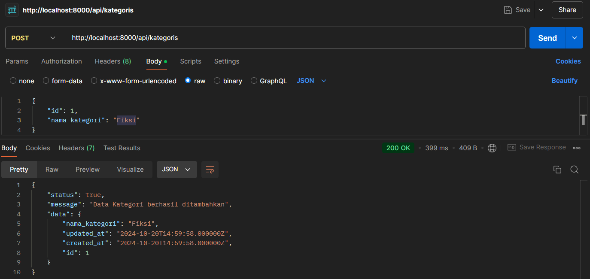
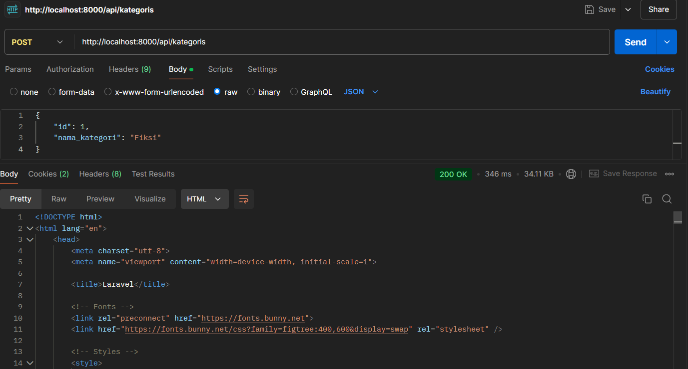
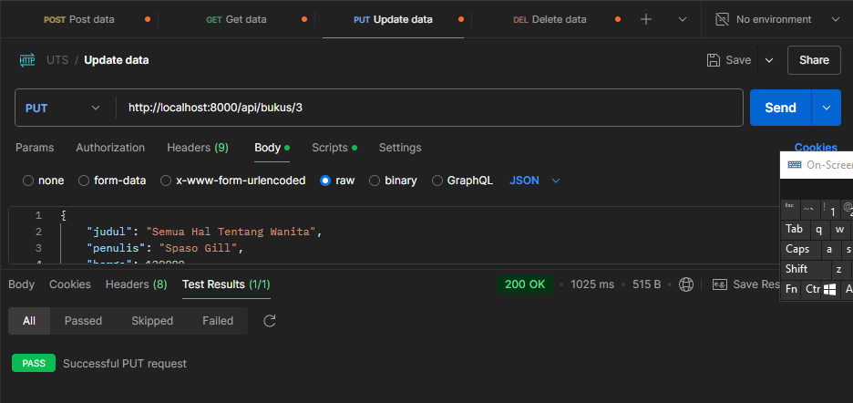
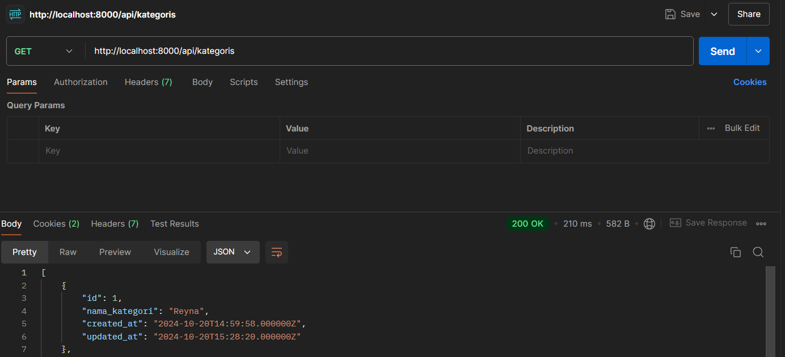
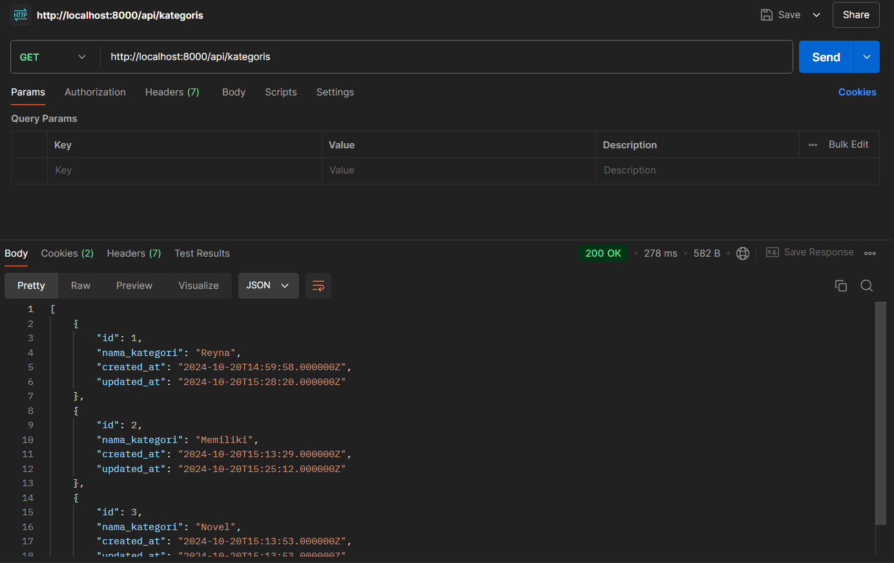
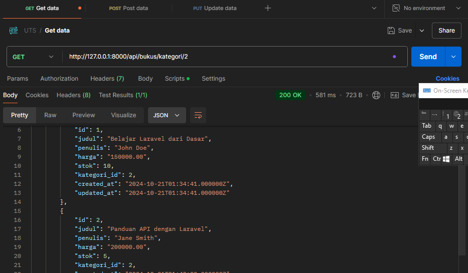
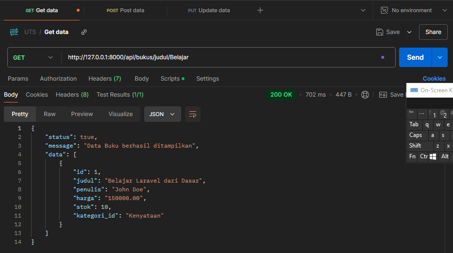
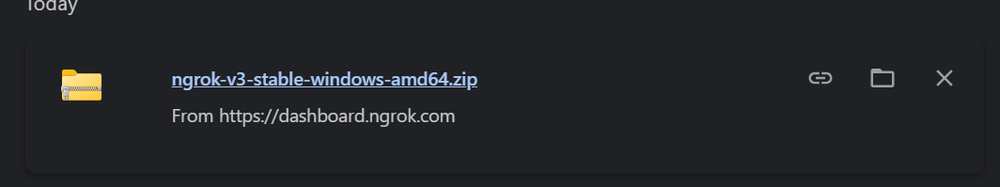
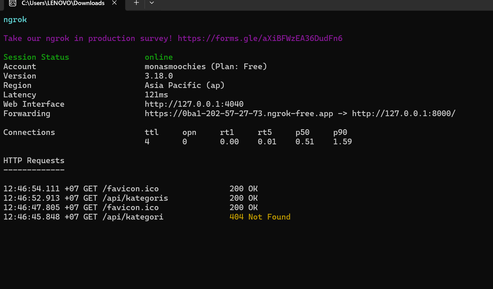

## Table Kategori

## Method Post

## Data tidak bisa di tambahkan karena pengaturan validasi

## Method Get

## Get dari postman

## Get dari Chrome
.png>)

## Method update 

## hasil data yang sudah di perbarui

## Method Delete

## sebelum data di hapus

## setelah ada data yang di hapus

## kategori_id

## judul

## ngrok 

